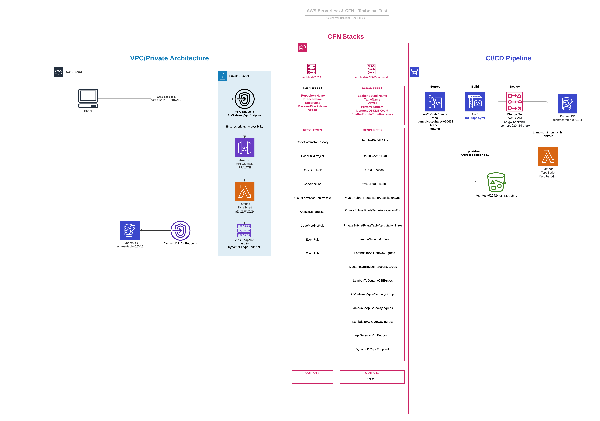

# technical-test-020424
Technical interview test for a fintech company, emphasis on Serverless infrastructure using CloudFormation templates.

## Structure

## Backend Stack
The `apigw-backend` folder contains a `function` folder with the lambda code, a `build-package-deploy` script that I was using to deploy the template as a standalone stack, a `function` folder which contains the function and its code. The `bin` folder also contains the script to create a bucket which the SAM deployment relies on as part of the package step.

The `buildspec.yml` and the `template.yaml` for the backend stack are also at the root of the `apigw-backend` folder.

The `tests` folders are a work in progress, the suites are having some unintended side effects where they make actual calls to the backend infrastructure if it is deployed, rather than mocking them as desired. I have included them for reference, and to show the direction I would take, where I would add a `test` phase into the pipeline.

I have tested this architecture in the cloud by creating test events for the lambda, and with the API gateway test functionality too.

## CI/CD Stack
The `cicd` folder contains a `create-changeset` script which I was using primarily to update the `cicd` pipeline when I made changes. It also contains a `deploy` script for the initial deployment.

## Private Architecture for backend
The architecture for the backend stack is private. The API is unable to be accessed publicly and I confirmed this via Postman testing.

## Public architecture
I did initially create the architecture as a public architecture, and confirmed via Postman testing that it worked.

You can find the public template in `/apigw-backend/public-template.yaml`. Please note that for the build to work, the `template.yaml` is the file referenced in that folder.

## Github Repo
If you would prefer to view this on Github, here is the repo link.

https://github.com/BenedictCodesHere/technical-test-020424