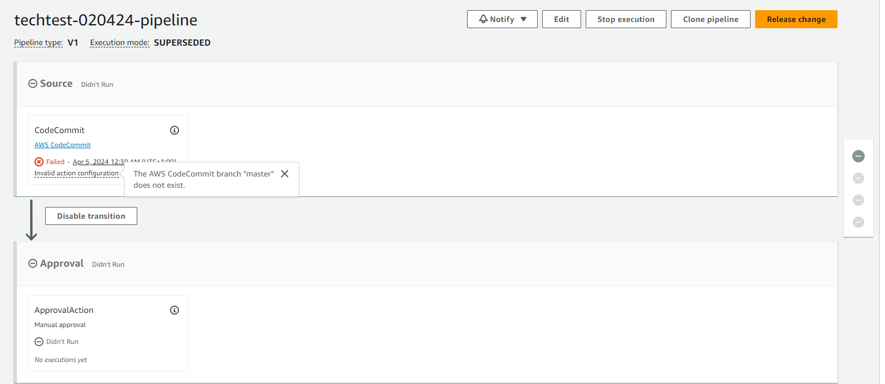

# Journal - Day 3 (04/04/24)

## Plan
Update Kanban board with today's tasks focus (Unit Tests, Integration Tests)

Research and implement unit and integration tests as part of the current workflow

## Unit Testing
I have been working on developing unit tests for the calls to DynamoDB, and am currently running into `ResourceNotFoundException` errors when attempting to test the mocked database.

## Postman Tests

I deployed the stack again, and then tested using Postman the endpoint and each of the `CRUD` methods. They all worked as expected.

This shows at least that the template is valid, but of course when it comes to automated tests as part of a CI/CD pipeline, we want to have mocked tests that run prior to approval.

## Unit Testing - Continued
I am able to get the unit test suites to pass, but the problem is that they are interacting with the actual data from the DynamoDB table, rather than mocking as is desired.

Also the unit tests are currently more like integration tests at this point, as they import the actual Lambda `handler`, and then use this with my AWS STS credentials, but end up actually making calls to the live database.

I will come back to the testing once I have checked that the CI/CD template deploys and, bar the testing, works as expected.

## CI/CD Pipeline - Template
I created the CI/CD template, it deploys successfully, however I am still ironing out issues. 

Currently, the fact that it is an empty `repo` throws an error in the CodePipeline:

It might be the case I need to populate the repository with files in order to resolve this.

